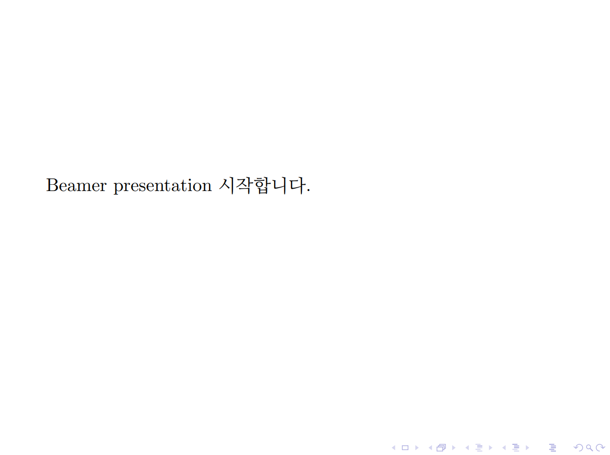

[00015 기본 Beamer 코드](./00015_기본_Beamer_코드.md)


```
\documentclass[serif]{beamer} 

\usepackage[english]{babel}
\usepackage{kotex}

\begin{document}

  \begin{frame}

    	Beamer presentation 시작합니다.

  \end{frame}
  
\end{document}
```

한글 사용을 위해서 kotex이라는 패키지를 사용하여야 한다. 문서 시작 앞에
```
\usepackage{kotex}
```
을 추가한다.

또한, \begin{frame} 와 \end{frame} 사이에 "Beamer presentation 시작합니다." 입력합니다.




[00020.tex](https://min7014.github.io/Making_materials_for_mathematics_using_Beamer/main/00020.tex) : Tex 파일

[00020.pdf](https://min7014.github.io/Making_materials_for_mathematics_using_Beamer/main/00020.pdf) : pdf 파일

다음 내용 : [00030 Frame Title](./00030_Frame_Title.md)

[목차](./README.md)

